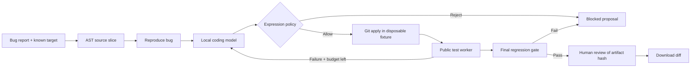

# PatchProof

### A coding-agent proposal is only the beginning. Make it prove itself.

**An interactive, local AI developer-tools lab by Nemanja Stancic.** Give a coding model a bug report, inspect its proposed diff, run independent checks, and approve an exact artifact before downloading the patch.

The project demonstrates the engineering around an AI coding workflow: source context, structured model output, execution limits, test-feedback retries, regression gates, traces, evaluation and human control.

**Python · FastAPI · llama.cpp · Qwen Coder · Python AST · Git · SQLite**

[Run the demo](#run-it) · [Five-minute walkthrough](#five-minute-demo) · [Architecture](#what-happens-in-a-run) · [Measured results](evidence/RESULTS.md) · [Interview discussion](docs/INTERVIEW.md)

## Reviewer snapshot

| Engineering question | What this project demonstrates |
|---|---|
| How is model output checked independently? | Frozen public/regression cases, bounded retries and a final gate whose cases never enter retry feedback. |
| What may a proposed patch execute? | A restricted expression interpreter; no `eval`, `exec`, imports or arbitrary tool calls. |
| How does a person retain control? | Approval is bound to the verified artifact SHA; rejected patches cannot be exported. |
| What has been verified? | 23 tests pass; all four correct fixtures reach review, and all four overfitting and unsafe fixtures are rejected. |

**Model status:** real Qwen 0.5B inference was evaluated and passed **0/4** tasks under this contract. Those failures are preserved in the [evaluation report](evidence/RESULTS.md). The configured Qwen 1.5B upgrade is **not yet benchmarked**. For the fully verified review workflow, begin with `python run.py --fixtures-only`; fixture proposals are explicitly labeled and are not model-generated.

## Run it

**Tested environment: Windows x64, Python 3.12, Git on PATH; fixture workflow and Qwen 0.5B baseline verified on CPU.**

```sh
python run.py
```

Open **http://127.0.0.1:4183**. First run creates `.venv`, installs Python dependencies and downloads the official **Qwen2.5-Coder-1.5B-Instruct Q4_K_M** model (~1.12 GB) plus the pinned Windows llama.cpp runtime (~18 MB). Both downloads are SHA-256 checked. Files stay under ignored `runtime/`; no model binaries are committed. Later runs reuse cached artifacts. Initial setup needs internet; inference stays local. No paid API account or credits.

To explore the verification system without downloading a model:

```sh
python run.py --fixtures-only
```

Select one of the clearly labeled **Fixture** proposal sources. These are deterministic test inputs, **not AI inference**. The real patch application, policy checks, test worker, approval gate and export still run.

On Linux/macOS, use Python 3.12 and Git, install `llama-server` from the [official llama.cpp project](https://github.com/ggml-org/llama.cpp), then run `python3 run.py`. Automatic binary setup, the fixture workflow and smaller-model inference were verified on Windows; the configured 1.5B inference and other platforms are not yet validated. The launcher expects the pinned runtime's CLI options.

## Five-minute demo

1. Select a bug report and **Local AI · Qwen Coder**. Run **Investigate & patch**.
2. Watch context assembly, bug reproduction, model calls, policy checks and test results in the live trace.
3. Inspect the diff and expand **Model calls & context** to see the actual prompts, model outputs and token usage.
4. A passing regression gate unlocks human review. Add a note, approve the artifact and download `.diff`.
5. Switch to **Fixture · overfits public tests**. Its patch fixes the examples while breaking other behavior; the regression gate blocks approval.
6. Try **Fixture · unsafe expression**. It is rejected before its expression reaches the verification worker.
7. Compare **Context only** with **Test-guided** on the same ticket, then inspect the scoreboard and export the run JSON.

The small local model can fail. Failure is retained and explained; there is no silent substitution of a known-good answer. A passing patch download is an artifact for review, not an automatic commit, merge or deployment.

## The four tasks

| Ticket | Bug | What naive fixes miss |
|---|---|---|
| SHOP-104 | Free shipping fails at the exact threshold | Lower totals must still pay shipping |
| API-218 | Final partial page is missing | Empty results and exact multiples |
| AUTH-031 | Owners cannot edit without admin rights | Non-owner/non-admin access must remain denied |
| OPS-072 | Retry backoff grows linearly | Exponential growth must still respect its cap |

Each task has **two public reproduction cases and eight regression cases**. Regression cases are withheld from model prompts and retry feedback, then revealed after the final gate. They are public in this repository; they are not a secret or contamination-resistant benchmark.

## What happens in a run



| Capability | Implementation |
|---|---|
| Context construction | Ticket-specified file/function → Python AST slice with line numbers and source SHA |
| Model inference | Local llama.cpp HTTP API, Qwen Coder, temperature 0, seed 42, JSON-schema output |
| Bounded orchestration | One active job, at most three calls, 180 output tokens per call, request timeouts |
| Patch workflow | Unified diff → `git apply --check` → apply to a disposable fixture copy |
| Verification | Separate trusted Python worker, 10-second deadline, fixed cases |
| Execution policy | Small AST expression language interpreted without `eval` or `exec` |
| Review gate | All cases must pass; reviewer approval bound to verified SHA-256 |
| Observability | Saved prompts, summaries, usage, timings, decisions, tests, diff and approval |
| Persistence | SQLite run records; interrupted runs marked after restart; history replay |

The context builder is **not semantic search or RAG**: each ticket identifies its target function. The model chooses the repair expression; a deterministic orchestrator controls the stages and retries. This is a bounded coding workflow, not a general-purpose autonomous developer.

## Tests and evaluations

After setup:

```powershell
.venv/Scripts/python -m pytest -q
.venv/Scripts/python evaluate.py --mode fixture_good
.venv/Scripts/python evaluate.py --mode fixture_overfit
.venv/Scripts/python evaluate.py --mode fixture_unsafe
```

With the local model running:

```powershell
.venv/Scripts/python evaluate.py --mode local_llm --strategy context_only
.venv/Scripts/python evaluate.py --mode local_llm --strategy test_guided
```

The evaluation CLI saves its reports separately from interactive history. Do not run the CLI and UI model jobs concurrently when comparing latency. See [measured results](evidence/RESULTS.md).

The tests cover forbidden syntax and numeric bounds, real diff application across all tasks, overfitting rejection, artifact tampering, stale approvals, idempotency, retry feedback, token accounting, provider failure, restart recovery and API restrictions. `ci/checks.yml` is a GitHub Actions template; move it to `.github/workflows/checks.yml` using a login with workflow permission to enable CI. It runs offline tests only; no model download or API key is required.

## Read the code

- `catalog.py`: task contracts, source fixtures and separate public/regression cases.
- `harness.py`: the orchestration loop and approval rules.
- `provider.py`: model request construction and actual token usage.
- `policy.py`: bounded AST validation and interpretation.
- `verify_worker.py`: reads the patched source and verifies its return expression.
- `store.py`, `app.py`: persistence, background execution and HTTP API.
- `web/`: browser interface with no frontend build step.
- `setup_model.py`, `run.py`: pinned downloads, checksum verification and local launch.

## Scope and engineering tradeoffs

**Expression repair, not arbitrary Python execution.** Proposals can replace one return expression using known arguments, bounded numeric/boolean operations, conditionals and `min`/`max`. Imports, attributes, collections, comprehensions, assignments and arbitrary function calls are rejected. The trusted worker interprets this small language. It does **not** import or execute model-generated Python. This makes the demo narrower than a real coding agent and avoids claiming that a subprocess is an OS security sandbox.

**Public-only feedback.** A failed reproduction test can be sent to the model for another attempt. The final regression gate runs once after the public loop; its outcomes are not fed back into that run. Reusing the same public fixture suite to tune prompts still creates benchmark-selection bias.

**Approval is local.** Only a passing run can be approved, and an artifact modified after verification is rejected. The download comes from the saved diff. Local SQLite and files are writable by the user; this is not a tamper-proof, authenticated multi-user audit system.

**Minimal network access.** Inference endpoints bind to loopback. The model server uses a locally generated key in ignored `runtime/model.key`; the key stays server-side and is not included in exported traces. The app enforces local Host/Origin checks. It has no public authentication service, tenancy, rate-limiting gateway or production authorization policy.

**No inflated effectiveness claim.** Four synthetic micro-tasks cannot establish real-repository solve rate or developer productivity. The UI scoreboard includes mixed repeated runs and separates deterministic fixtures. Model summaries are not evidence of correctness; tests are independent and still incomplete.

## Why this fits AI developer-tools roles

These primary-source job descriptions were checked on September 17, 2026. They show relevant engineering themes, not a market-wide ranking or a claim that this project meets every seniority requirement:

- [Gusto — AI Developer Tools](https://job-boards.greenhouse.io/gusto/jobs/7947684?gh_src=Blind): context-aware coding workflows, evaluations, code safety, latency and token efficiency.
- [Coder — Agentic Engineering](https://jobs.ashbyhq.com/coder/e75e3ee8-6bc2-49fb-91aa-f398c0fc2630): agent harnesses, tool execution, context management and reliability.
- [Guild.ai — Agents & Evaluation](https://jobs.ashbyhq.com/guild/c49e1f4c-2989-4e51-ac40-f974efa4936f/): task definitions, evaluation harnesses and measurable coding-agent quality.

Use the project to discuss **how you know a patch is correct, how much context a model needs, what it may execute, and what happens when it fails**. Those are stronger engineering conversations than showing a successful chat response alone.

## Learning roadmap

1. Add a fifth task with independent public and regression cases. Make an overfit fixture that your gate rejects.
2. Change the prompt and compare both solve rate and token cost; keep failure reports.
3. Replace the known-target AST slice with repository search. Evaluate retrieval separately from repair quality.
4. Add a real repository runner inside a purpose-built OS/container sandbox with no credentials or network access. Do not simply replace the interpreter with `exec`.
5. Add signed artifacts, authenticated review, a durable queue and a GitHub integration that creates draft PRs only after approval.

See [interview walkthrough](docs/INTERVIEW.md) for discussion prompts and a concise project summary.

## Upstream software

- [Qwen2.5-Coder-1.5B-Instruct-GGUF](https://huggingface.co/Qwen/Qwen2.5-Coder-1.5B-Instruct-GGUF), Apache 2.0; upstream model license applies to the downloaded artifact.
- [llama.cpp](https://github.com/ggml-org/llama.cpp), MIT; pinned Windows release `b11026`.
- Direct Python dependencies are pinned; `requirements-lock.txt` records the tested Windows/Python 3.12 environment.

## Related portfolio projects

- [Document AI Workbench](https://github.com/cws1121/document-ai-workbench): neural OCR, source evidence and auditable review.
- [ML Drift Control Room](https://github.com/cws1121/ml-drift-control-room): drift monitoring, independent evaluation and model promotion.
